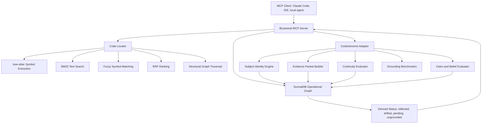
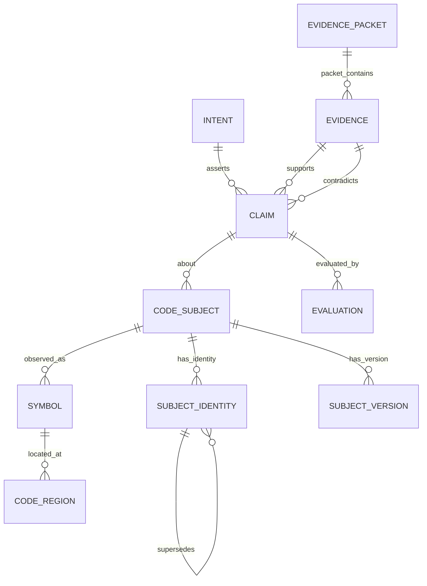
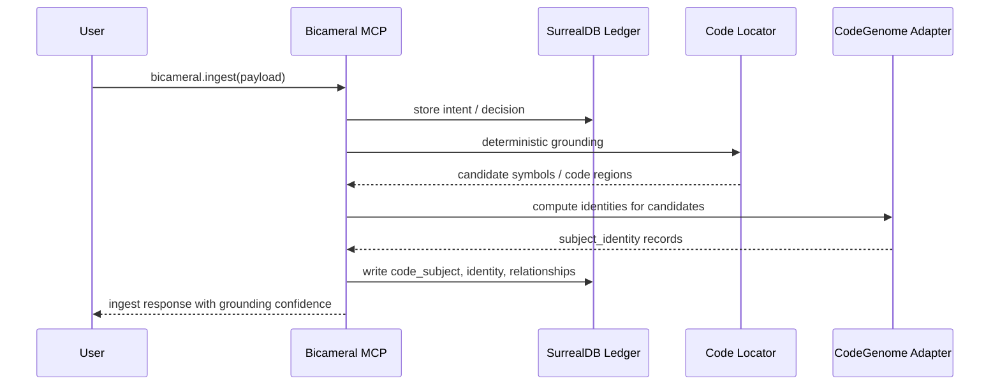
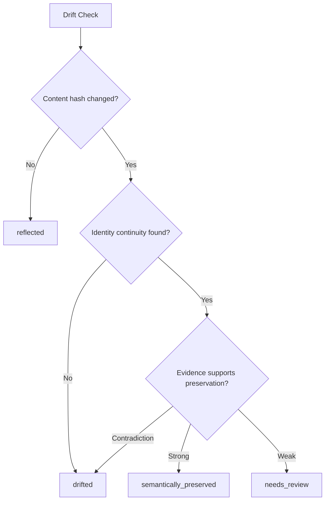
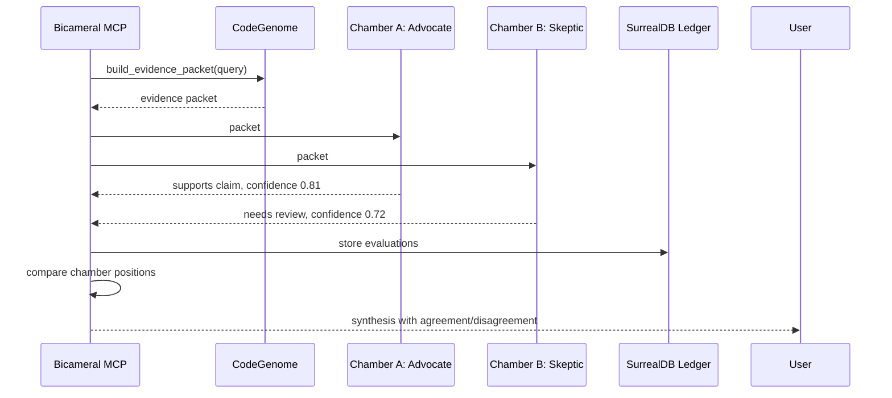

# Bicameral-Arc.md

# Bicameral Architecture Plan: CodeGenome Knowledge Layer over SurrealDB

## Status

Proposed architecture.

This document defines how Bicameral should evolve its current SurrealDB-backed decision ledger into a richer CodeGenome-enabled knowledge layer. The goal is not to replace Bicameral's current database, deterministic retrieval model, or MCP tool surface. The goal is to add durable code identity, claim modeling, evidence evaluation, and continuity semantics so Bicameral can reason over decisions, code, drift, and implementation truth with stronger grounding.

Bicameral remains the product-facing MCP decision layer. SurrealDB remains the operational graph database. CodeGenome becomes the identity, evidence, and evaluation engine that enriches Bicameral's graph.

## Relevant Resources

Internal project resources:

- Bicameral MCP repository: https://github.com/Knapp-Kevin/bicameral-mcp
- CodeGenome repository: https://github.com/MythologIQ-Labs-LLC/CodeGenome
- FailSafe repository: https://github.com/MythologIQ-Labs-LLC/FailSafe
- Agent Governance Toolkit reference repository: https://github.com/microsoft/agent-governance-toolkit

External technical references:

- SurrealDB documentation: https://surrealdb.com/docs
- SurrealQL documentation: https://surrealdb.com/docs/surrealql
- Model Context Protocol specification: https://spec.modelcontextprotocol.io/
- tree-sitter documentation: https://tree-sitter.github.io/tree-sitter/
- BM25 background: https://en.wikipedia.org/wiki/Okapi_BM25
- Reciprocal Rank Fusion background: https://plg.uwaterloo.ca/~gvcormac/cormacksigir09-rrf.pdf
- BLAKE3 hashing: https://github.com/BLAKE3-team/BLAKE3
- Mermaid diagrams: https://mermaid.js.org/

## Executive Summary

Bicameral currently provides a local-first provenance-aware decision layer for a codebase. It ingests transcripts, PRDs, and design documents, maps decisions to code symbols, and derives status such as `reflected`, `drifted`, `pending`, or `ungrounded` from the relationship between intent and code.

The current architecture is strong because it is deterministic, local, and explainable. It uses SurrealDB as an embedded graph store and a code locator based on tree-sitter, BM25, fuzzy matching, RRF ranking, and graph traversal. That makes Bicameral practical and deployable.

The limitation is that current grounding is still primarily location-oriented. It maps decisions to symbols and code regions. This works until code is renamed, moved, split, merged, heavily refactored, or rewritten by agents. At that point, the decision may still be conceptually valid, but the old location-based anchor may no longer be enough.

CodeGenome should solve that gap.

The proposed direction is to build CodeGenome as a knowledge substrate that enriches Bicameral with durable identity, intent-to-subject resolution, claim and belief modeling, evidence packets, refactor continuity, confidence evaluation, contradiction evaluation, and benchmark-driven grounding quality measurement.

The final architecture should be:

```text
SurrealDB = Bicameral operational graph
Code Locator = deterministic retrieval and symbol extraction
CodeGenome = identity, evidence, continuity, and evaluation engine
Bicameral MCP = public tool surface and workflow orchestration
```

## Design Goals

### Preserve Bicameral's current strengths

The design must preserve Bicameral's local-first operating model, deterministic retrieval path, embedded SurrealDB graph, MCP surface, and query-time status derivation.

CodeGenome enrichment should improve grounding and drift analysis without forcing Bicameral to depend on unstable experimental internals.

### Add identity beyond location

Bicameral needs to understand that a code concept can survive movement. A function may be renamed. A class may move files. A module may split into smaller modules. An agent may rewrite an implementation while preserving behavior.

The knowledge layer must track durable identity rather than only file and line position.

### Make evidence explicit

Bicameral should not merely say that a decision is reflected or drifted. It should explain why.

Every derived conclusion should be backed by evidence:

```text
claim -> subject -> supporting evidence -> contradicting evidence -> confidence -> evaluator -> timestamp
```

### Support chambered reasoning

Bicameral should be able to support independent reasoning chambers. The knowledge layer should provide structured evidence packets that separate chambers can consume, evaluate, and compare.

The knowledge layer should make it possible to ask:

```text
Did both chambers use the same evidence?
Did they disagree about evidence quality?
Did one chamber find contradiction the other missed?
Did confidence increase because independent signals agreed?
```

### Keep experimental internals behind a stable adapter

CodeGenome is still an experimental substrate. Its overlay structure, scoring models, embeddings, and continuity heuristics may change. Bicameral should not bind directly to those internal details.

The adapter boundary should expose stable outputs:

```text
subject candidates
identity records
evidence packets
claim evaluations
continuity records
drift evaluations
```

## Non-Goals

This architecture does not make CodeGenome the production database for Bicameral.

This architecture does not require LLMs for core Bicameral operation.

This architecture does not replace deterministic BM25, tree-sitter, fuzzy matching, RRF ranking, or existing status derivation.

This architecture does not require a separate database server.

This architecture does not make CodeGenome's overlay internals part of Bicameral's public schema.

This architecture does not require immediate claim clustering, semantic embeddings, or behavioral proof as production-critical features. Those should be added behind flags and validated through benchmarks.

## Current Bicameral Model

Bicameral currently works as a decision ledger and code locator.

The simplified current model is:

```text
intent -> maps_to -> symbol -> implements -> code_region
```

The current status model is query-derived:

```text
no mapped code_region -> ungrounded
symbol absent at git ref -> pending
content_hash differs -> drifted
content_hash matches -> reflected
```

This model is valuable because status is not stale stored state. It is derived from intent and git reference at query time.

The weakness is that `content_hash differs` does not always mean conceptual drift. It may mean a harmless refactor. Likewise, `content_hash matches` does not always prove that intent is satisfied if surrounding dependencies changed.

CodeGenome should improve the semantic resolution of this status model without replacing it.

## Target Model

The proposed target model extends Bicameral from a decision-to-location graph into a decision-to-identity-and-evidence graph.

```text
intent
  -> asserts
      -> claim
          -> about
              -> code_subject
                  -> observed_as
                      -> symbol
                          -> located_at
                              -> code_region
                  -> has_identity
                      -> subject_identity
                  -> has_version
                      -> subject_version

claim
  -> supported_by
      -> evidence

claim
  -> contradicted_by
      -> evidence

subject_identity
  -> supersedes
      -> subject_identity

claim
  -> evaluated_by
      -> evaluation
```

## Architecture Overview



### Data Ownership

SurrealDB owns operational Bicameral state.

Code Locator owns deterministic code indexing and retrieval.

CodeGenome owns experimental identity and evaluation logic.

Bicameral MCP owns the public tool surface and response contracts.

### Why this split matters

This split prevents Bicameral from depending on experimental CodeGenome internals while still benefiting from CodeGenome outputs.

If a future CodeGenome experiment replaces the overlay model, changes confidence scoring, or adds embeddings, Bicameral should not need a major rewrite. Only the adapter and output records should change.

## Core Domain Concepts

### Intent

An intent is a decision, requirement, constraint, design choice, or implementation goal extracted from a transcript, PRD, design document, issue, or manual user input.

Existing Bicameral intent records should remain the root product-facing object.

### Claim

A claim is a normalized statement that can be evaluated against code or other evidence.

Examples:

```text
The checkout endpoint enforces rate limiting.
The admin route requires authorization.
The retry mechanism uses exponential backoff.
The refactor preserves public API behavior.
```

An intent may produce one or more claims.

### Code Subject

A code subject is a conceptual target that can be reasoned about over time.

Examples:

```text
function
class
method
module
route
middleware
schema
test case
configuration block
```

A code subject can be observed as one or more concrete symbols or code regions.

### Subject Identity

A subject identity is the durable address or fingerprint associated with a code subject.

It may include:

```text
structural signature
symbol kind
canonical name
module path
call graph neighborhood
body hash
signature hash
test associations
documentation associations
behavioral profile
```

The identity record should be allowed to evolve. Different strategies can be tested without changing Bicameral's public API.

### Evidence

Evidence is any artifact that supports or contradicts a claim.

Examples:

```text
code region
symbol body
test result
commit diff
runtime trace
review comment
PRD section
transcript excerpt
prior decision
agent evaluation
manual assertion
```

### Evaluation

An evaluation records how a chamber, agent, tool, or human interpreted evidence.

Examples:

```text
supports claim with confidence 0.82
contradicts claim with confidence 0.74
needs review because runtime evidence is missing
believes refactor preserved behavior with confidence 0.67
```

### Evidence Packet

An evidence packet is the stable object passed from CodeGenome to Bicameral or from Bicameral to reasoning chambers.

It should contain:

```text
query or claim
candidate subjects
supporting evidence
contradicting evidence
prior beliefs
recent changes
confidence summary
known uncertainties
open questions
```

## SurrealDB Schema Extension

The schema below is an incremental extension. It should be introduced behind migrations and feature flags.

### Tables

```sql
DEFINE TABLE code_subject SCHEMAFULL;
DEFINE FIELD kind ON code_subject TYPE string;
DEFINE FIELD canonical_name ON code_subject TYPE string;
DEFINE FIELD repo_ref ON code_subject TYPE option<string>;
DEFINE FIELD current_confidence ON code_subject TYPE number;
DEFINE FIELD created_at ON code_subject TYPE datetime;
DEFINE FIELD updated_at ON code_subject TYPE datetime;

DEFINE TABLE subject_identity SCHEMAFULL;
DEFINE FIELD address ON subject_identity TYPE string;
DEFINE FIELD identity_type ON subject_identity TYPE string;
DEFINE FIELD structural_signature ON subject_identity TYPE option<string>;
DEFINE FIELD behavioral_signature ON subject_identity TYPE option<string>;
DEFINE FIELD signature_hash ON subject_identity TYPE option<string>;
DEFINE FIELD content_hash ON subject_identity TYPE option<string>;
DEFINE FIELD confidence ON subject_identity TYPE number;
DEFINE FIELD model_version ON subject_identity TYPE string;
DEFINE FIELD created_at ON subject_identity TYPE datetime;

DEFINE TABLE subject_version SCHEMAFULL;
DEFINE FIELD repo_ref ON subject_version TYPE string;
DEFINE FIELD file_path ON subject_version TYPE string;
DEFINE FIELD start_line ON subject_version TYPE int;
DEFINE FIELD end_line ON subject_version TYPE int;
DEFINE FIELD symbol_name ON subject_version TYPE option<string>;
DEFINE FIELD symbol_kind ON subject_version TYPE option<string>;
DEFINE FIELD content_hash ON subject_version TYPE option<string>;
DEFINE FIELD signature_hash ON subject_version TYPE option<string>;
DEFINE FIELD created_at ON subject_version TYPE datetime;

DEFINE TABLE claim SCHEMAFULL;
DEFINE FIELD text ON claim TYPE string;
DEFINE FIELD normalized_text ON claim TYPE string;
DEFINE FIELD claim_type ON claim TYPE string;
DEFINE FIELD confidence ON claim TYPE number;
DEFINE FIELD created_by ON claim TYPE string;
DEFINE FIELD created_at ON claim TYPE datetime;

DEFINE TABLE evidence SCHEMAFULL;
DEFINE FIELD evidence_type ON evidence TYPE string;
DEFINE FIELD source_ref ON evidence TYPE string;
DEFINE FIELD summary ON evidence TYPE string;
DEFINE FIELD confidence ON evidence TYPE number;
DEFINE FIELD payload ON evidence TYPE option<object>;
DEFINE FIELD created_at ON evidence TYPE datetime;

DEFINE TABLE evaluation SCHEMAFULL;
DEFINE FIELD evaluator ON evaluation TYPE string;
DEFINE FIELD evaluator_kind ON evaluation TYPE string;
DEFINE FIELD verdict ON evaluation TYPE string;
DEFINE FIELD confidence ON evaluation TYPE number;
DEFINE FIELD rationale ON evaluation TYPE string;
DEFINE FIELD created_at ON evaluation TYPE datetime;

DEFINE TABLE evidence_packet SCHEMAFULL;
DEFINE FIELD query_text ON evidence_packet TYPE string;
DEFINE FIELD repo_ref ON evidence_packet TYPE string;
DEFINE FIELD confidence_summary ON evidence_packet TYPE object;
DEFINE FIELD uncertainties ON evidence_packet TYPE array<string>;
DEFINE FIELD created_at ON evidence_packet TYPE datetime;
```

### Relation Tables

```sql
DEFINE TABLE asserts TYPE RELATION FROM intent TO claim;
DEFINE FIELD confidence ON asserts TYPE number;

DEFINE TABLE about TYPE RELATION FROM claim TO code_subject;
DEFINE FIELD confidence ON about TYPE number;

DEFINE TABLE observed_as TYPE RELATION FROM code_subject TO symbol;
DEFINE FIELD confidence ON observed_as TYPE number;

DEFINE TABLE has_identity TYPE RELATION FROM code_subject TO subject_identity;
DEFINE FIELD confidence ON has_identity TYPE number;

DEFINE TABLE has_version TYPE RELATION FROM code_subject TO subject_version;
DEFINE FIELD confidence ON has_version TYPE number;

DEFINE TABLE supports TYPE RELATION FROM evidence TO claim;
DEFINE FIELD confidence ON supports TYPE number;

DEFINE TABLE contradicts TYPE RELATION FROM evidence TO claim;
DEFINE FIELD confidence ON contradicts TYPE number;

DEFINE TABLE supersedes TYPE RELATION FROM subject_identity TO subject_identity;
DEFINE FIELD change_type ON supersedes TYPE string;
DEFINE FIELD confidence ON supersedes TYPE number;
DEFINE FIELD evidence_refs ON supersedes TYPE array<string>;

DEFINE TABLE evaluated_by TYPE RELATION FROM claim TO evaluation;
DEFINE FIELD confidence ON evaluated_by TYPE number;

DEFINE TABLE packet_contains TYPE RELATION FROM evidence_packet TO evidence;
DEFINE FIELD role ON packet_contains TYPE string;
DEFINE FIELD confidence ON packet_contains TYPE number;
```

### Entity Relationship Diagram



## CodeGenome Adapter

Bicameral should call CodeGenome through a stable Python adapter. The adapter hides CodeGenome's internal overlay or scoring experiments.

### Adapter Interface

```python
# bicameral/codegenome/adapter.py

from __future__ import annotations

from dataclasses import dataclass, field
from typing import Any, Literal


@dataclass(frozen=True)
class SubjectCandidate:
    address: str
    file_path: str
    start_line: int
    end_line: int
    symbol_name: str | None
    symbol_kind: str | None
    confidence: float
    reason: str


@dataclass(frozen=True)
class SubjectIdentity:
    address: str
    identity_type: str
    structural_signature: str | None
    behavioral_signature: str | None
    signature_hash: str | None
    content_hash: str | None
    confidence: float
    model_version: str


@dataclass(frozen=True)
class EvidenceRecord:
    evidence_type: Literal[
        "code",
        "test",
        "diff",
        "runtime",
        "doc",
        "decision",
        "agent_eval",
        "manual",
    ]
    source_ref: str
    summary: str
    confidence: float
    payload: dict[str, Any] = field(default_factory=dict)


@dataclass(frozen=True)
class DriftEvaluation:
    intent_id: str
    repo_ref: str
    status: Literal[
        "reflected",
        "drifted",
        "pending",
        "ungrounded",
        "semantically_preserved",
        "needs_review",
    ]
    confidence: float
    rationale: str
    supporting_evidence: list[EvidenceRecord]
    contradicting_evidence: list[EvidenceRecord]


@dataclass(frozen=True)
class EvidencePacket:
    packet_id: str
    query_text: str
    repo_ref: str
    subjects: list[SubjectCandidate]
    supporting_evidence: list[EvidenceRecord]
    contradicting_evidence: list[EvidenceRecord]
    uncertainties: list[str]
    confidence_summary: dict[str, float]


class CodeGenomeAdapter:
    """Stable adapter between Bicameral and CodeGenome.

    Bicameral should depend on this interface, not on CodeGenome's
    internal overlay, embedding, or scoring implementation.
    """

    def resolve_subjects(
        self,
        claim_text: str,
        repo_ref: str = "HEAD",
        max_candidates: int = 10,
    ) -> list[SubjectCandidate]:
        raise NotImplementedError

    def compute_identity(
        self,
        file_path: str,
        start_line: int,
        end_line: int,
        repo_ref: str = "HEAD",
    ) -> SubjectIdentity:
        raise NotImplementedError

    def evaluate_drift(
        self,
        intent_id: str,
        repo_ref: str = "HEAD",
    ) -> DriftEvaluation:
        raise NotImplementedError

    def build_evidence_packet(
        self,
        query_text: str,
        repo_ref: str = "HEAD",
        max_subjects: int = 10,
    ) -> EvidencePacket:
        raise NotImplementedError
```

### Initial No-LLM Implementation

The first implementation should reuse Bicameral's deterministic locator and add identity records.

```python
# bicameral/codegenome/deterministic_adapter.py

from __future__ import annotations

import hashlib
from pathlib import Path

from .adapter import CodeGenomeAdapter, SubjectCandidate, SubjectIdentity


class DeterministicCodeGenomeAdapter(CodeGenomeAdapter):
    def __init__(self, repo_path: Path, code_locator):
        self.repo_path = repo_path
        self.code_locator = code_locator

    def resolve_subjects(
        self,
        claim_text: str,
        repo_ref: str = "HEAD",
        max_candidates: int = 10,
    ) -> list[SubjectCandidate]:
        results = self.code_locator.search_code(query=claim_text)
        candidates: list[SubjectCandidate] = []

        for result in results[:max_candidates]:
            candidates.append(
                SubjectCandidate(
                    address=self._address_for_result(result),
                    file_path=result.file_path,
                    start_line=result.start_line,
                    end_line=result.end_line,
                    symbol_name=getattr(result, "symbol_name", None),
                    symbol_kind=getattr(result, "symbol_kind", None),
                    confidence=float(result.score),
                    reason="deterministic BM25/RRF code locator match",
                )
            )

        return candidates

    def compute_identity(
        self,
        file_path: str,
        start_line: int,
        end_line: int,
        repo_ref: str = "HEAD",
    ) -> SubjectIdentity:
        source_path = self.repo_path / file_path
        source = source_path.read_text(encoding="utf-8")
        lines = source.splitlines()
        body = "\n".join(lines[start_line - 1 : end_line])

        content_hash = hashlib.blake2b(body.encode("utf-8"), digest_size=32).hexdigest()
        structural_signature = f"{file_path}:{start_line}:{end_line}"
        signature_hash = hashlib.blake2b(
            structural_signature.encode("utf-8"),
            digest_size=32,
        ).hexdigest()

        return SubjectIdentity(
            address=f"cg:{signature_hash}",
            identity_type="deterministic_location_v1",
            structural_signature=structural_signature,
            behavioral_signature=None,
            signature_hash=signature_hash,
            content_hash=content_hash,
            confidence=0.65,
            model_version="deterministic-location-v1",
        )

    def _address_for_result(self, result) -> str:
        raw = f"{result.file_path}:{result.start_line}:{result.end_line}"
        digest = hashlib.blake2b(raw.encode("utf-8"), digest_size=32).hexdigest()
        return f"cg:{digest}"
```

This is intentionally conservative. It does not pretend to solve semantic continuity yet. It creates a stable adapter and gives Bicameral a place to receive CodeGenome identity outputs.

## Ingestion Flow

### Target Flow



### Suggested Ingestion Hook

```python
# bicameral/ledger/ingest_service.py

async def ingest_with_codegenome(payload, ledger, code_locator, codegenome):
    intent = await ledger.create_intent(payload)

    candidate_symbols = code_locator.ground_intent(
        text=intent.description,
        max_candidates=10,
    )

    for candidate in candidate_symbols:
        subject = await ledger.upsert_code_subject(
            kind=candidate.symbol_kind or "unknown",
            canonical_name=candidate.symbol_name or candidate.file_path,
            current_confidence=candidate.confidence,
        )

        identity = codegenome.compute_identity(
            file_path=candidate.file_path,
            start_line=candidate.start_line,
            end_line=candidate.end_line,
            repo_ref="HEAD",
        )

        await ledger.upsert_subject_identity(subject.id, identity)
        await ledger.link_intent_to_subject(intent.id, subject.id, candidate.confidence)

    return await ledger.get_intent_summary(intent.id)
```

## Drift Flow

### Current Drift Logic

```text
content_hash matches -> reflected
content_hash differs -> drifted
```

### Enhanced Drift Logic

```text
content_hash differs
  -> evaluate subject identity continuity
  -> evaluate structural similarity
  -> evaluate tests and evidence
  -> evaluate prior claims
  -> derive reflected / drifted / semantically_preserved / needs_review
```

### Drift Diagram



### Suggested Drift Hook

```python
# bicameral/drift/enhanced_drift.py

async def derive_status_with_codegenome(intent_id: str, ledger, codegenome, repo_ref: str = "HEAD"):
    base_status = await ledger.derive_status(intent_id=intent_id, repo_ref=repo_ref)

    if base_status.status != "drifted":
        return base_status

    evaluation = codegenome.evaluate_drift(intent_id=intent_id, repo_ref=repo_ref)

    if evaluation.status == "semantically_preserved" and evaluation.confidence >= 0.75:
        return {
            "status": "reflected",
            "semantic_status": "semantically_preserved",
            "confidence": evaluation.confidence,
            "rationale": evaluation.rationale,
            "evidence": evaluation.supporting_evidence,
        }

    if evaluation.status == "needs_review":
        return {
            "status": "drifted",
            "semantic_status": "needs_review",
            "confidence": evaluation.confidence,
            "rationale": evaluation.rationale,
            "evidence": evaluation.supporting_evidence,
            "contradictions": evaluation.contradicting_evidence,
        }

    return base_status
```

## Evidence Packet Contract

Evidence packets should be the main boundary between CodeGenome and chambered reasoning.

### JSON Shape

```json
{
  "packet_id": "ep_001",
  "query_text": "Does the checkout endpoint enforce rate limiting?",
  "repo_ref": "HEAD",
  "subjects": [
    {
      "address": "cg:abc123",
      "file_path": "src/checkout/rate_limit.py",
      "start_line": 24,
      "end_line": 67,
      "symbol_name": "enforce_checkout_rate_limit",
      "symbol_kind": "function",
      "confidence": 0.91,
      "reason": "BM25/RRF match plus symbol-name overlap"
    }
  ],
  "supporting_evidence": [
    {
      "evidence_type": "test",
      "source_ref": "tests/test_checkout_rate_limit.py::test_limit_exceeded",
      "summary": "Test verifies checkout requests are blocked after threshold.",
      "confidence": 0.83,
      "payload": {}
    }
  ],
  "contradicting_evidence": [
    {
      "evidence_type": "diff",
      "source_ref": "git:HEAD~1..HEAD",
      "summary": "Recent change bypasses middleware for admin checkout path.",
      "confidence": 0.76,
      "payload": {}
    }
  ],
  "uncertainties": [
    "No runtime trace confirms production behavior."
  ],
  "confidence_summary": {
    "subject_resolution": 0.91,
    "support": 0.83,
    "contradiction": 0.76,
    "overall": 0.68
  }
}
```

### Pydantic Contract

```python
# bicameral/codegenome/contracts.py

from __future__ import annotations

from pydantic import BaseModel, Field


class SubjectCandidateModel(BaseModel):
    address: str
    file_path: str
    start_line: int
    end_line: int
    symbol_name: str | None = None
    symbol_kind: str | None = None
    confidence: float = Field(ge=0.0, le=1.0)
    reason: str


class EvidenceRecordModel(BaseModel):
    evidence_type: str
    source_ref: str
    summary: str
    confidence: float = Field(ge=0.0, le=1.0)
    payload: dict = Field(default_factory=dict)


class EvidencePacketModel(BaseModel):
    packet_id: str
    query_text: str
    repo_ref: str
    subjects: list[SubjectCandidateModel]
    supporting_evidence: list[EvidenceRecordModel]
    contradicting_evidence: list[EvidenceRecordModel]
    uncertainties: list[str]
    confidence_summary: dict[str, float]
```

## Chambered Reasoning Support

Bicameral should support independent chamber evaluations that consume the same evidence packet.

### Chamber Flow



### Chamber Evaluation Schema

```python
# bicameral/chambers/types.py

from pydantic import BaseModel, Field


class ChamberEvaluation(BaseModel):
    chamber_id: str
    claim_id: str
    packet_id: str
    position: str
    confidence: float = Field(ge=0.0, le=1.0)
    rationale: str
    evidence_used: list[str]
    uncertainties: list[str]
```

### Comparison Logic

```python
# bicameral/chambers/compare.py

from __future__ import annotations


def compare_chamber_positions(evaluations):
    positions = {item.chamber_id: item.position for item in evaluations}
    confidences = {item.chamber_id: item.confidence for item in evaluations}

    unique_positions = set(positions.values())

    if len(unique_positions) == 1:
        return {
            "agreement": "aligned",
            "position": unique_positions.pop(),
            "confidence_range": [min(confidences.values()), max(confidences.values())],
        }

    return {
        "agreement": "divergent",
        "positions": positions,
        "confidence_range": [min(confidences.values()), max(confidences.values())],
        "recommended_action": "request_human_review_or_collect_more_evidence",
    }
```

## Confidence Model

The first confidence model should be simple, inspectable, and replaceable.

### Signal Types

```text
subject_resolution_confidence
structural_identity_confidence
content_similarity_confidence
call_graph_similarity_confidence
test_support_confidence
runtime_support_confidence
contradiction_confidence
chamber_agreement_confidence
```

### Noisy-OR for Independent Support

```python
# bicameral/codegenome/confidence.py

from __future__ import annotations


def noisy_or(confidences: list[float]) -> float:
    """Fuse independent supporting confidence values.

    Example:
        [0.7, 0.7] -> 0.91
    """
    product = 1.0
    for confidence in confidences:
        bounded = max(0.0, min(1.0, confidence))
        product *= 1.0 - bounded
    return 1.0 - product


def weighted_average(signals: dict[str, float], weights: dict[str, float]) -> float:
    total_weight = 0.0
    total = 0.0

    for key, value in signals.items():
        weight = weights.get(key, 0.0)
        total += value * weight
        total_weight += weight

    if total_weight == 0.0:
        return 0.0

    return total / total_weight
```

### Initial Weights

```python
DEFAULT_CONFIDENCE_WEIGHTS = {
    "subject_resolution": 0.25,
    "structural_identity": 0.20,
    "content_similarity": 0.15,
    "call_graph_similarity": 0.15,
    "test_support": 0.15,
    "runtime_support": 0.10,
}
```

These weights are not sacred. They are an initial hypothesis. They should be benchmarked and adjusted.

## Query-Time Status Derivation

Bicameral's public status model should remain stable at first.

Internally, CodeGenome can add richer semantic status states:

```text
reflected
semantically_preserved
partially_reflected
identity_moved
identity_renamed
pending
ungrounded
drifted
contradicted
needs_review
```

The public mapping should initially remain compatible:

```text
semantically_preserved -> reflected with semantic_status metadata
identity_moved -> reflected or needs_review depending confidence
identity_renamed -> reflected or needs_review depending confidence
partially_reflected -> drifted with partial metadata
contradicted -> drifted
needs_review -> drifted or review_required depending UI support
```

### Status Mapping Function

```python
# bicameral/status/mapping.py

PUBLIC_STATUS_MAP = {
    "reflected": "reflected",
    "semantically_preserved": "reflected",
    "identity_moved": "reflected",
    "identity_renamed": "reflected",
    "partially_reflected": "drifted",
    "contradicted": "drifted",
    "needs_review": "drifted",
    "pending": "pending",
    "ungrounded": "ungrounded",
    "drifted": "drifted",
}


def to_public_status(semantic_status: str, confidence: float) -> str:
    if semantic_status in {"identity_moved", "identity_renamed"} and confidence < 0.75:
        return "drifted"
    return PUBLIC_STATUS_MAP.get(semantic_status, "drifted")
```

## Integration Points with Existing MCP Tools

### bicameral.ingest

Enhance ingest to create claims, code subjects, subject identities, and initial evidence records.

### bicameral.search

Enhance search to return evidence packets when requested.

Suggested optional parameter:

```json
{
  "query": "add checkout rate limiting",
  "max_results": 10,
  "min_confidence": 0.5,
  "include_evidence_packet": true
}
```

### bicameral.drift

Enhance drift to call CodeGenome when content hash drift is detected.

### bicameral.status

Enhance status to include semantic status metadata without breaking existing status values.

Example response addition:

```json
{
  "status": "reflected",
  "semantic_status": "semantically_preserved",
  "semantic_confidence": 0.81,
  "semantic_rationale": "Function body changed, but identity and tests indicate behavior was preserved."
}
```

### bicameral.link_commit

Enhance link_commit to generate subject versions and continuity candidates.

## Feature Flags

Add feature flags to keep rollout safe.

```yaml
codegenome:
  enabled: false
  write_identity_records: false
  enhance_search: false
  enhance_drift: false
  expose_evidence_packets: false
  chamber_evaluations: false
  benchmark_mode: true
```

Suggested config loader:

```python
# bicameral/config/codegenome.py

from pydantic import BaseModel


class CodeGenomeConfig(BaseModel):
    enabled: bool = False
    write_identity_records: bool = False
    enhance_search: bool = False
    enhance_drift: bool = False
    expose_evidence_packets: bool = False
    chamber_evaluations: bool = False
    benchmark_mode: bool = True
```

## Testing Strategy

Testing should decide the architecture, not decorate it after the fact like a sad little QA wreath.

### Unit Tests

Test adapter contracts, confidence functions, schema serialization, status mapping, and evidence packet validation.

```python
# tests/test_codegenome_confidence.py

from bicameral.codegenome.confidence import noisy_or


def test_noisy_or_two_independent_70_percent_signals():
    assert round(noisy_or([0.7, 0.7]), 2) == 0.91


def test_noisy_or_empty_returns_zero():
    assert noisy_or([]) == 0.0
```

### Integration Tests

Test ingestion with CodeGenome enabled.

```python
# tests/test_codegenome_ingest_integration.py

import pytest


@pytest.mark.asyncio
async def test_ingest_creates_subject_identity(test_ledger, code_locator, codegenome):
    payload = {
        "source": "prd",
        "text": "Checkout must enforce rate limiting before payment processing.",
    }

    result = await ingest_with_codegenome(payload, test_ledger, code_locator, codegenome)

    assert result["intent_id"]
    identities = await test_ledger.find_subject_identities_for_intent(result["intent_id"])
    assert len(identities) >= 1
```

### Drift Tests

Use controlled fixture repos where a symbol is changed in known ways.

Test cases:

```text
body whitespace change -> reflected / semantically preserved
function rename -> identity_renamed
file move -> identity_moved
logic removal -> drifted
partial implementation -> partially_reflected
missing tests -> needs_review
```

### Benchmark Tests

Create a benchmark corpus from real historical repository changes.

Each benchmark case should include:

```text
intent text
expected relevant files
expected relevant symbols
actual diff
expected status
human rationale
risk grade
```

Benchmark metrics:

```text
Top-1 subject resolution accuracy
Top-5 subject resolution accuracy
false positive subject matches
false negative missed subjects
identity continuity accuracy
semantic drift precision
semantic drift recall
evidence packet usefulness
chamber disagreement clarity
```

### Benchmark Case Format

```json
{
  "case_id": "checkout-rate-limit-001",
  "intent_text": "Checkout must enforce rate limiting before payment processing.",
  "repo_ref_before": "abc123",
  "repo_ref_after": "def456",
  "expected_subjects": [
    "src/checkout/rate_limit.py::enforce_checkout_rate_limit"
  ],
  "expected_status": "reflected",
  "known_risk": "security",
  "human_rationale": "The middleware remained active and tests verify blocked requests."
}
```

## Migration Plan

### Phase 0: Documentation and Design Lock

Create this architecture document, define the adapter boundary, define SurrealDB schema extensions, and define benchmark cases.

Exit criteria:

```text
Bicameral-Arc.md committed
adapter contract reviewed
schema draft reviewed
benchmark corpus format accepted
```

### Phase 1: Adapter Skeleton

Add `bicameral/codegenome/adapter.py`, Pydantic contracts, and feature flags.

Exit criteria:

```text
adapter tests pass
no existing MCP behavior changes
feature flags default to off
```

### Phase 2: Identity Record Write Path

During ingest, compute deterministic identity records for grounded symbols and write them to SurrealDB.

Exit criteria:

```text
ingest creates identity records
existing status output unchanged
identity records can be queried by intent
```

### Phase 3: Evidence Packet API

Add evidence packet generation behind a flag.

Exit criteria:

```text
bicameral.search can optionally return evidence packets
evidence packets validate with Pydantic
supporting and contradicting evidence are separated
```

### Phase 4: Enhanced Drift Evaluation

When a content hash differs, call CodeGenome evaluation before finalizing drift.

Exit criteria:

```text
rename and move fixtures detected
logic-removal fixture still drifted
public status remains backward compatible
semantic_status metadata added
```

### Phase 5: Chamber Evaluations

Add optional chamber evaluation records and comparison tools.

Exit criteria:

```text
two independent evaluations can be stored
agreement and disagreement can be summarized
all evaluations trace back to evidence packet IDs
```

### Phase 6: Benchmark-Guided Promotion

Use benchmark results to decide which CodeGenome internals should be promoted from experimental to canonical.

Exit criteria:

```text
benchmark suite passes agreed thresholds
retrieval quality exceeds existing deterministic baseline
continuity detection improves drift quality
false reflected and false drifted rates are reduced
```

## Recommended Repository Structure

```text
bicameral_mcp/
  codegenome/
    __init__.py
    adapter.py
    deterministic_adapter.py
    contracts.py
    confidence.py
    evidence_packet.py
    status_mapping.py
    continuity.py
    surreal_repository.py

  chambers/
    __init__.py
    types.py
    compare.py

  migrations/
    codegenome_identity.surql
    codegenome_evidence.surql

  benchmarks/
    cases/
      checkout-rate-limit-001.json
      auth-refactor-001.json
    runner.py
    metrics.py

tests/
  test_codegenome_adapter.py
  test_codegenome_confidence.py
  test_codegenome_evidence_packet.py
  test_codegenome_ingest_integration.py
  test_codegenome_drift.py
  test_chamber_compare.py
```

## Risks and Mitigations

| Risk | Impact | Mitigation |
|---|---|---|
| CodeGenome internals change too quickly | Bicameral breaks | Use stable adapter and output records only |
| Semantic confidence is misleading | Bad status derivation | Keep public status conservative; benchmark confidence calibration |
| Schema grows too fast | SurrealDB graph becomes hard to reason about | Add schema in phases behind flags |
| Evidence packets become too large | Slow MCP responses | Use summaries, caps, and lazy expansion |
| LLM-dependent features creep into core | Local deterministic promise weakens | Keep LLM features optional and never required for baseline operation |
| Refactor continuity false positives | Drift hidden incorrectly | Require confidence thresholds and contradiction checks |
| Chamber evaluations become untraceable prose | Bicameral loses evidence discipline | Store evidence IDs used by each chamber |

## Open Questions

1. Should CodeGenome identity addresses use BLAKE3, BLAKE2, or a UOR-compatible address format for the Bicameral layer?
2. Should evidence packets be persisted by default or generated on demand?
3. Should chamber evaluations be part of Bicameral core or an optional extension?
4. Should semantic statuses be exposed publicly or mapped to the existing four statuses until mature?
5. Should embeddings remain optional or become part of the default CodeGenome resolver after benchmarks prove value?
6. Should CodeGenome consume Bicameral's SurrealDB data directly, or should all access pass through a repository abstraction?

## Final Recommendation

Build on top of SurrealDB at the Bicameral schema and API boundary. Run CodeGenome in parallel at the experimental engine boundary.

That means:

```text
SurrealDB stores canonical Bicameral state.
CodeGenome computes identity, continuity, evidence, and evaluation outputs.
Bicameral writes stable CodeGenome-derived records into SurrealDB.
Experimental CodeGenome overlays remain hidden behind the adapter.
```

This gives Bicameral the knowledge layer it needs without forcing the product to depend on an unstable research substrate.

The right next implementation step is Phase 1: add the adapter skeleton, contracts, confidence helpers, feature flags, and tests. Do not begin with a database migration until the adapter contract is stable.
