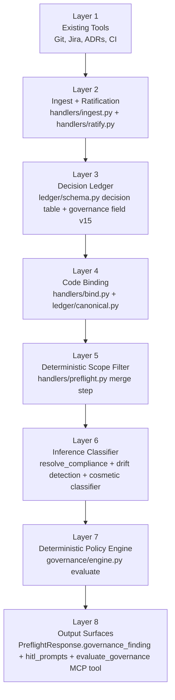
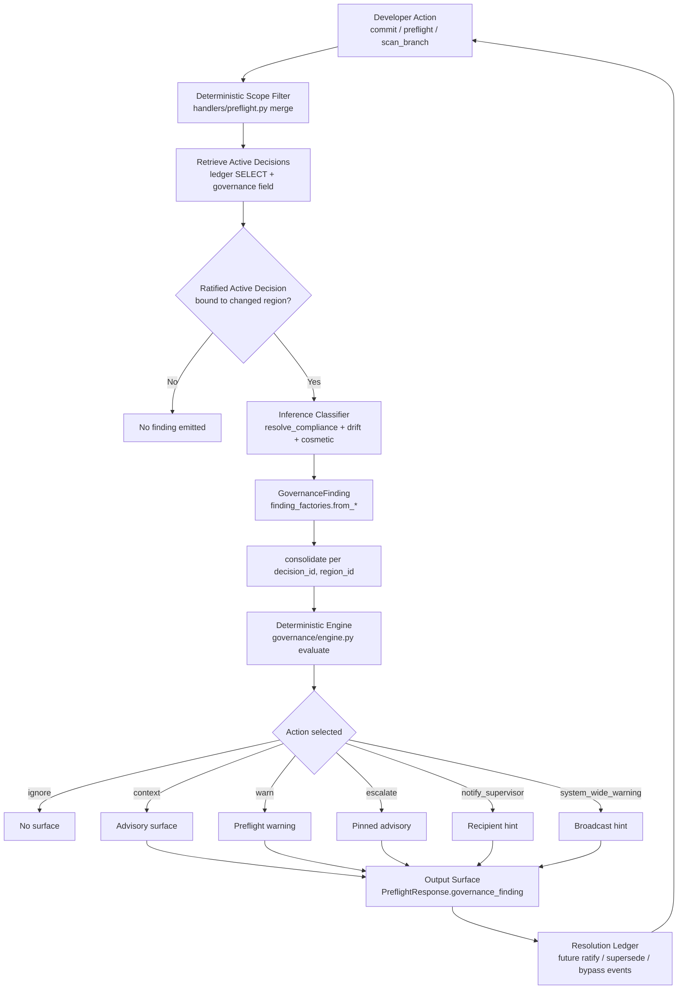

# Semantic Drift Governance

## Purpose

This document explains how Bicameral routes semantic drift findings into deterministic visibility actions without ever blocking engineering execution. It describes the governance surface that shipped across Phases 1-4 of the #108-#112 plan: the Pydantic contracts (`governance/contracts.py`), the deterministic policy engine (`governance/engine.py`), the YAML config loader (`governance/config.py`), the finding factories (`governance/finding_factories.py`), the MCP read tool (`handlers/evaluate_governance.py`), the MCP write tool (`handlers/record_bypass.py`), and the bypassable HITL prompt flow that piggybacks on `preflight_telemetry.py`.

## What Bicameral Is and Is Not

**Bicameral is**:

- A decision-continuity tracker. Decisions ratified via the ledger keep a stable identity across edits, refactors, and supersessions.
- A drift-exposure system. When a code region bound to a ratified decision changes in a way that may violate the decision, Bicameral surfaces the drift with evidence.
- A transparency router. Findings flow through a deterministic engine that selects a visibility action (ignore, context, warn, escalate, notify_supervisor, system_wide_warning) and an audit trail.
- An advisory layer over your existing tools. Bicameral reads the work; your existing tools (Git, Jira, ADRs, CI) own the work.

**Bicameral is not**:

- A code reviewer. The compliance verdict comes from a caller-supplied LLM judge against a real region; Bicameral records the verdict, it does not author the review.
- A merge blocker. `governance/config.py:GovernanceConfig.allow_blocking` is locked at `Literal[False]`. Pydantic refuses any other value at parse time.
- An enforcement authority. The strongest native action is `system_wide_warning`. There is no "fail the build" escalation tier.
- A replacement for ADRs, Jira, CI, or PR review. Those systems remain authoritative; Bicameral observes outcomes and points back at the originating decision.
- An autonomous compliance engine. Every escalation tier above `warn` is gated on a deterministic conditions ladder that includes ratification, active state, protected class, and confidence thresholds.

## Product Thesis

**Existing tools record work. Bicameral verifies whether the work still obeys the ratified decision.**

Git tracks file content. Jira tracks tickets. ADRs capture intent at a moment in time. CI checks invariants per build. None of those systems answer "does this commit still respect what we decided two weeks ago?". Bicameral binds decisions to code regions and re-verifies the binding on every relevant change.

## Governance Thesis

**Inference detects ambiguity. Deterministic policy decides visibility. Humans retain authority. Bicameral never blocks work.**

The system splits two concerns that conventional review tools collapse:

- **Inference** answers fuzzy questions: "is this region semantically related to that decision?", "does this change drift from the ratified intent?", "how confident is the binding?". LLMs and structural analyzers produce these signals.
- **Determinism** answers the next question: "given the inference signal, what visibility does this finding deserve?". A pure function over (finding, metadata, config, decision_status, bypass_recency) returns a single ladder position. No randomness, no LLM in the policy path.

The split keeps inference quality improvements (better LLM judges, better embedding models) decoupled from policy stability. A user reading `governance.yml` can predict exactly what the engine will do with a given finding, regardless of how the finding was produced.

## Layered Architecture



Layers 1-4 are existing infrastructure; layers 5-8 are the governance surface. The split between layer 6 (inference) and layer 7 (determinism) is the core architectural commitment.

## Where Inference Lives

Inference is anywhere a fuzzy answer drives a downstream selection. Bicameral concentrates inference into four well-bounded steps:

- **Candidate extraction**. The ingest skill (`skills/bicameral-ingest/SKILL.md`) classifies decisions into L1, L2, or L3 based on identity-write semantics. The classifier is LLM-driven, but its output (`decision_level`) is a closed enum the rest of the system treats as ground truth.
- **Decision classification**. `governance/contracts.py:derive_governance_metadata` maps `decision_level` to a (decision_class, risk_class, escalation_class) triple via the L1/L2/L3 default table when explicit `GovernanceMetadata` is absent. Explicit metadata supplied at ingest time overrides the derived defaults.
- **Change relevance**. `handlers/preflight.py` runs the deterministic scope filter first, then asks the inference layer (resolve_compliance verdicts, cosmetic-vs-semantic classifier from #44, drift detection) which of the in-scope decisions actually have evidence of drift. The factory builders in `governance/finding_factories.py` (`from_compliance_verdict`, `from_drift_entry`, `from_preflight_drift_candidate`) translate those signals into `GovernanceFinding` objects.
- **Semantic drift classification**. The compliance verdict (`compliant` / `drifted` / `not_relevant`) and the cosmetic-vs-semantic classifier produce the `semantic_status` field on a finding. The status enum is closed (`not_relevant` ... `critical_drift`) and ranked by `_SEMANTIC_RANK` in `governance/engine.py`.

After this point, no inference touches the policy decision.

## Where Determinism Lives

Once a `GovernanceFinding` exists, every step is a pure function over closed inputs. `governance/engine.py:evaluate()` is the public surface; it composes four helpers, each bounded under 40 LOC:

- **`_check_required_conditions`** evaluates the conditions ladder declared in `config.required_conditions_for_supervisor_notification`. The default ladder has six entries:
  - `decision_status_is_ratified` -- the decision passed ratification.
  - `decision_is_active` -- the decision is `ratified` or `active` (not superseded, not rejected).
  - `protected_decision_class` -- `metadata.protected_component` is true OR `decision_class` is `security` or `compliance`.
  - `no_superseding_decision` -- `decision_status != "superseded"`.
  - `drift_confidence_above_threshold` -- the finding's `confidence["drift_confidence"]` meets the per-class supervisor threshold.
  - `binding_confidence_above_threshold` -- same for binding confidence.

  Conditions that pass land in `policy_result.matched_conditions`; failures land in `policy_result.missing_conditions`. Both lists ship in the audit trail.

- **`_apply_class_defaults`** reads `config.decision_classes[metadata.decision_class]` and bumps the per-class `default_action` according to the finding's `semantic_status` rank. `not_relevant` returns `ignore`; `cosmetic_change` lifts to `context`; `possible_drift`/`needs_human_review` lift to `warn`; `likely_drift` lifts to `escalate`; `confirmed_drift`/`critical_drift` lift further to `notify_supervisor` or `system_wide_warning` only when the class policy explicitly permits it. When no class policy exists, the engine falls back to a vanilla rank-to-action mapping so a config without a `decision_classes` block still produces a sensible ladder.

- **`_apply_bypass_downgrade`** drops the action one tier on `_ACTION_LADDER` when `bypass_recency_seconds` is below `_BYPASS_RECENCY_WINDOW_SECONDS` (3600s, one hour). `ignore` cannot drop further. The recency value is computed by `preflight_telemetry.recent_bypass_seconds(decision_id)` at the call site; the engine itself stays pure.

- **`_apply_max_native_ceiling`** caps the action at `config.max_native_action`. Anything stronger is clamped. There is no special case for `allow_blocking` -- it is locked at `Literal[False]`, so the engine never considers blocking as an option.

The orchestrator returns a `GovernancePolicyResult` carrying the final action, the gate name (`governance:<decision_class>`), the matched/missing condition lists, the evidence refs, the suggested recipients (from `metadata.notification_channels`), and a `requires_human_resolution` flag set to true for `notify_supervisor` and `system_wide_warning`.

## Action Ladder

```
ignore  <  context  <  warn  <  escalate  <  notify_supervisor  <  system_wide_warning
```

`GovernanceAction` is the `Literal` enum on `GovernancePolicyResult.action` in `governance/contracts.py`. Tier semantics:

- **`ignore`** -- finding is recorded but not surfaced anywhere. Used for `not_relevant` semantics.
- **`context`** -- finding shows up in advisory surfaces (preflight, evaluate_governance) but does not generate a notification. Used for `cosmetic_change` and trivial refactors.
- **`warn`** -- visible advisory; the developer sees it in their preflight output. Default for `possible_drift` and similar low-severity signals.
- **`escalate`** -- visible plus elevated treatment by the surface (e.g. preflight pins the finding above other notes). Default for `likely_drift` on protected classes.
- **`notify_supervisor`** -- visible plus a recipient hint pulled from `metadata.notification_channels`. Requires the conditions ladder to clear AND `class_policy.supervisor_notification_allowed=true`.
- **`system_wide_warning`** -- visible plus a system-level broadcast hint. Requires `class_policy.system_wide_warning_allowed=true` AND the conditions ladder. This is the strongest native tier; `config.max_native_action` clamps anything stronger back to this rung.

The ladder is internal to `governance/engine.py` as `_ACTION_LADDER`. Index = severity.

## Non-Blocking Rule

**Bicameral does not natively block any engineering action.**

`config.allow_blocking: Literal[False]` enforces this at the type level. Pydantic raises `ValidationError` if any caller attempts to set `allow_blocking=True` in `.bicameral/governance.yml`. There is no runtime check to bypass; the type itself refuses the value. The strongest native action the engine can produce is `system_wide_warning`, which surfaces a broadcast hint but never blocks a commit, a PR, a merge, a CI run, a release, or a Claude Code continuation.

The non-blocking absolute is also reinforced by:

- `config.max_native_action` -- a per-config ceiling (default `system_wide_warning`). A user who wants a softer ceiling can set `max_native_action: warn` and the engine will clamp every escalation back to `warn`.
- `_apply_max_native_ceiling` -- the engine helper that performs the clamp. There is no code path that emits an action above the ceiling.
- The MCP tool surface -- `bicameral.evaluate_governance` is read-only; `bicameral.record_bypass` writes a local JSONL line and never touches the ledger.

## HITL Prompt Behavior

When `handlers/preflight.py` surfaces a decision whose signoff state is unresolved, it emits a `HITLPrompt` (defined in `governance/contracts.py`) on `PreflightResponse.hitl_prompts`. The trigger enum covers five states:

- `proposed` -- the decision was captured but never ratified.
- `ai_surfaced` -- Bicameral inferred the decision from context and the human has not confirmed it.
- `needs_context` -- the decision lacks enough binding context to verify drift.
- `collision_pending` -- two decisions plausibly compete for the same region.
- `context_pending` -- the decision is waiting on a context completion.

Each prompt carries a `question` string and a `list[HITLPromptOption]`. Options are typed by `kind` (`ratify`, `reject`, `needs_context`, `defer`, `bypass`, `supersedes_a_b`, `supersedes_b_a`, `keep_parallel`, `confirm_proposed`, `ratify_now`). The skill side asserts that the LAST option's `kind == "bypass"`. Bypass is mandatory and always last.

When the user selects bypass, the agent calls `bicameral.record_bypass(decision_id, reason?)`. The handler at `handlers/record_bypass.py` is a thin wrapper around `preflight_telemetry.write_bypass_event`:

- Returns `{recorded: True, deduped: False}` on a fresh write.
- Returns `{recorded: False, deduped: True}` when a prior bypass for the same `decision_id` is still inside the V4 idempotency window (1 hour). This prevents a misbehaving caller from indefinitely suppressing escalations on a sensitive decision -- the FIRST bypass establishes the recency fingerprint; subsequent calls inside the hour cannot extend it.
- Returns `{recorded: False, deduped: False, reason: "telemetry_disabled"}` when `BICAMERAL_PREFLIGHT_TELEMETRY` is off. Telemetry is opt-in by default per the v0.15.0 privacy contract; bypass storage inherits the same opt-in.

Bypass writes a `preflight_prompt_bypassed` event to `~/.bicameral/preflight_events.jsonl`. **Bypass does NOT mutate decision state.** The `signoff_state` of the underlying decision row is unchanged. Future preflights will surface the same unresolved state again -- the only effect of a recent bypass is that the engine drops one tier on the action ladder for findings on that decision (acknowledgement that the user has seen the unresolved state, not a permanent suppression).

The recency lookup is `preflight_telemetry.recent_bypass_seconds(decision_id)`. It is an F3-bounded tail-read: scans at most the last 1000 lines of the JSONL file and breaks early on the first event older than the recency window. Per-call cost is O(min(N, 1000)) regardless of file size. The 50 MB rotation cap on the JSONL writer bounds the worst case further.

## MVP Configuration by File

Governance is configured per-repo via `.bicameral/governance.yml`. The canonical example is `docs/governance.example.yml`. Copy it to `.bicameral/governance.yml` and tune to your project.

The schema is defined by `governance/config.py:GovernanceConfig`:

```yaml
version: 1
mode: transparency_first              # Literal["transparency_first"]; only legal value.
allow_blocking: false                 # Literal[False]. Pydantic refuses true.
strongest_result_wins: true           # Consolidate winner = highest semantic severity.
max_native_action: system_wide_warning  # Ceiling for the action ladder.

protected_components: []              # Free-form path/glob list.

decision_classes:                     # Per-class policy. Class keys must be one
  security:                           # of the eight values in
    default_action: escalate          # GovernanceMetadata.decision_class.
    supervisor_notification_allowed: true
    system_wide_warning_allowed: true
    escalation_thresholds:
      drift_confidence: 0.7
      binding_confidence: 0.7
    supervisor_thresholds:
      drift_confidence: 0.85
      binding_confidence: 0.85
  # ... more classes
  
required_conditions_for_supervisor_notification:
  - decision_status_is_ratified
  - decision_is_active
  - protected_decision_class
  - no_superseding_decision
  - drift_confidence_above_threshold
  - binding_confidence_above_threshold
```

`load_config()` (in `governance/config.py`) is fail-soft: a missing file returns the baked-in defaults; a malformed YAML or pydantic validation error logs a stderr warning and returns the defaults. The non-blocking absolute extends to startup -- a typo in the config file does not prevent the server from running.

YAML parsing uses `yaml.safe_load`, never `yaml.load`. Tag-driven object construction is forbidden.

Note: `GovernanceMetadata.decision_class` is a closed enum with eight values. The full list:

```
product_behavior | architecture | security | compliance |
data_contract | operational_reliability |
implementation_preference | experimental
```

`risk_class` is `low | medium | high | critical`. `escalation_class` is `context_only | warn | escalate | notify_supervisor_allowed | system_wide_warning_allowed`. All three are `Literal` enums on `governance/contracts.py:GovernanceMetadata`.

## Worked Example: A Finding's Journey

To make the inference/determinism split concrete, follow a finding from change to action.

**Scenario.** A developer edits `handlers/auth.py:verify_token`. A previously-ratified L2 decision `dec_42` declares "auth tokens MUST be validated against the JWT issuer claim before granting access". The decision was bound at `region_7` (`handlers/auth.py:verify_token`), and explicit `GovernanceMetadata` was supplied at ingest:

```yaml
decision_class: security
risk_class: high
escalation_class: notify_supervisor_allowed
owner: alice@example.com
supervisor: bob@example.com
notification_channels: ["#auth-team", "bob@example.com"]
protected_component: true
```

**Step 1: deterministic prefilter.** `handlers/preflight.py` sees `region_7` in the changed regions and pulls `dec_42` plus its governance metadata in a single SELECT.

**Step 2: inference.** The cosmetic-vs-semantic classifier examines the diff. The change touches the JWT validation path; not cosmetic. The compliance verdict (`resolve_compliance` LLM judge) returns `drifted` with `confidence: "high"` (mapped to 0.9). Drift evidence is captured in `evidence_refs`.

**Step 3: finding construction.** `from_compliance_verdict(verdict, metadata)` builds:

```python
GovernanceFinding(
    finding_id="...",
    decision_id="dec_42",
    region_id="region_7",
    decision_class="security",
    risk_class="high",
    escalation_class="notify_supervisor_allowed",
    source="resolve_compliance",
    semantic_status="likely_drift",
    confidence={"verdict_confidence": "high", "drift_confidence": 0.9, "binding_confidence": 0.95},
    explanation="...",
    evidence_refs=[...],
)
```

**Step 4: deterministic engine.** `evaluate(finding, metadata, config, decision_status="ratified", bypass_recency_seconds=None)`:

- `_check_required_conditions` -- with the example config from `docs/governance.example.yml`, the `security` class has `supervisor_thresholds.drift_confidence=0.85` and `binding_confidence=0.85`. Both confidences clear. The decision is ratified, active, security-class (protected), not superseded. ALL six conditions match. `missing = []`.
- `_apply_class_defaults` -- security class has `default_action=escalate`, `system_wide_warning_allowed=true`, `supervisor_notification_allowed=true`. The finding's `semantic_status="likely_drift"` has rank 4. `_apply_class_defaults` returns `_max_action("escalate", "escalate") = "escalate"`. (For `confirmed_drift` rank 5+, it would lift to `system_wide_warning` because `system_wide_warning_allowed=true`.)
- `_apply_bypass_downgrade` -- `bypass_recency_seconds=None`, no change. Returns `escalate`.
- `_apply_max_native_ceiling` -- `config.max_native_action="system_wide_warning"`; `escalate` is below the ceiling. No change.

Final result:

```python
GovernancePolicyResult(
    action="escalate",
    gate="governance:security",
    reason="action=escalate; semantic_status=likely_drift; decision_class=security; risk_class=high; matched=decision_status_is_ratified,decision_is_active,protected_decision_class,no_superseding_decision,drift_confidence_above_threshold,binding_confidence_above_threshold; missing=",
    matched_conditions=["decision_status_is_ratified", "decision_is_active", "protected_decision_class", "no_superseding_decision", "drift_confidence_above_threshold", "binding_confidence_above_threshold"],
    missing_conditions=[],
    evidence_refs=[...],
    suggested_recipients=["#auth-team", "bob@example.com"],
    requires_human_resolution=False,
)
```

**Step 5: surface.** The finding (with `policy_result` attached) lands on `PreflightResponse.governance_finding`. The skill renders it as a pinned advisory with the recipient hints. The developer sees: "This change drifts from `dec_42` (security, ratified). Consider notifying #auth-team and bob@example.com."

**Step 6: bypass scenario.** Suppose the developer instead bypassed an earlier preflight prompt on `dec_42` 30 minutes ago. `recent_bypass_seconds("dec_42")` returns ~1800. `_apply_bypass_downgrade("escalate", 1800)` drops one tier to `warn`. The finding still surfaces, but as a warning rather than an escalation -- acknowledgement that the user has seen the unresolved state. After 60 minutes, the recency expires; the next preflight returns to full `escalate`.

**Step 7: confirmed drift.** Suppose later the LLM judge upgrades the verdict to `confirmed_drift` (rank 5). `_apply_class_defaults` now returns `system_wide_warning` (because `system_wide_warning_allowed=true`). All conditions still match. `requires_human_resolution=True`. The skill surfaces a broadcast hint -- but no commit, no PR, no merge is blocked. The developer remains in control of when to act.

This is the entire engine path. Every step is reproducible from the inputs.

## V15 Schema Migration

Phase 1 added a single migration to `ledger/schema.py`:

```sql
DEFINE FIELD OVERWRITE governance ON decision FLEXIBLE TYPE option<object> DEFAULT NONE
```

The field is FLEXIBLE so the nested `GovernanceMetadata` object persists with its keys intact (per the v2 SurrealDB FLEXIBLE-object contract referenced in `CLAUDE.md`). Pre-v15 decisions migrate cleanly: `governance` defaults to NONE for existing rows, and `derive_governance_metadata` falls back to the L1/L2/L3 default table when reading them.

`SCHEMA_VERSION = 15` was bumped accordingly; `SCHEMA_COMPATIBILITY` documents v15 as compatible with the 0.17.x line. Idempotency: running the migration twice is a no-op (`OVERWRITE` is idempotent in v2).

## MCP Tool Surface

Two MCP tools are exposed by the governance package.

### `bicameral.evaluate_governance` (read)

Read-only ad-hoc evaluation. Useful from skill context (`/qor-audit`, manual review) when an agent wants to ask "if drift were detected here, what would Bicameral do?" without triggering a full preflight.

Inputs:

- `decision_id: str` -- required.
- `region_id: str | None` -- optional; defaults to `None`.
- `source: str` -- optional caller hint; arbitrary unknown values fall back to `llm_judge`.

Output: `EvaluateGovernanceResponse` carrying either a `finding` (with `policy_result` attached) or an `error` string (`unknown_decision_id`, `ledger_client_unavailable`).

The handler synthesizes a conservative finding with `semantic_status="possible_drift"` -- the neutral starting status -- because the caller has not yet supplied a real signal. Callers with stronger signals should pre-build the finding via the factories and run `engine.evaluate` directly.

### `bicameral.record_bypass` (write)

Records that the user bypassed a preflight HITL prompt. Thin wrapper around `preflight_telemetry.write_bypass_event`.

Inputs:

- `decision_id: str` -- required.
- `reason: str` -- optional; defaults to `"user_bypassed"`.
- `state_preserved: str` -- optional; defaults to `"proposed"`. The unresolved signoff state at the time of bypass, recorded for audit.

Output: `RecordBypassResponse` with `recorded: bool`, `deduped: bool`, `reason: str | None`.

Three outcomes:

- Fresh bypass: `{recorded: True, deduped: False, reason: None}`.
- Within recency window: `{recorded: False, deduped: True, reason: None}`.
- Telemetry off: `{recorded: False, deduped: False, reason: "telemetry_disabled"}`.

The handler is one of the very few WRITE tools in the MCP surface; it is the minimum required to support bypass from skill context.

## Fail-Soft Posture

Bicameral's "never block work" principle extends to its own startup. Every layer that could refuse to run on bad input falls back to a safe default instead:

- **Missing `.bicameral/governance.yml`** -- `load_config()` returns the baked-in `transparency_first` defaults. No error.
- **Malformed YAML** -- caught as `yaml.YAMLError`, logged at WARNING, defaults returned.
- **Schema validation error** -- caught as `pydantic.ValidationError`, logged at WARNING, defaults returned.
- **Telemetry disabled** -- `write_bypass_event` is a no-op; `record_bypass` returns `{recorded: False, reason: "telemetry_disabled"}`. The HITL prompt still surfaces; only the bypass-recency tier-drop is unavailable.
- **Unknown `source` string passed to `evaluate_governance`** -- coerced to `llm_judge`. The tool still evaluates.
- **Unknown decision_level** -- `derive_governance_metadata` falls back to L1 defaults (`product_behavior`, `medium`, `warn`).
- **Pre-v15 decision rows** -- `governance` field is NONE; engine reads via `derive_governance_metadata`.
- **Unknown condition string in a future-version config** -- `_check_required_conditions` reports it as missing rather than raising. The audit trail surfaces the gap.

The only hard refusal in the entire stack is `allow_blocking: true` in the YAML config -- and that refusal is structural (pydantic `Literal[False]`), not a runtime check. Even there, the rest of the system continues to load with the value rejected.

## Performance Model

- **Deterministic prefilter first**. `handlers/preflight.py` filters candidate decisions by region/path overlap before any inference runs. Inference only fires for decisions plausibly in scope.
- **Cached decision lookup**. Decision rows are read once per preflight; the `governance` field is included in the same SELECT (`v15` migration adds it as a flexible optional object, see `ledger/schema.py:_TABLES`).
- **Inference only for plausible risk**. The compliance verdict and the cosmetic-vs-semantic classifier are LLM calls. Neither runs for `not_relevant` candidates.
- **No model call per file change**. Drift detection is structural (`ledger/drift.py`); compliance verification is LLM-driven but only when drift is detected against a ratified decision.
- **F3-bounded JSONL tail-read for bypass-recency lookup**. `recent_bypass_seconds` reads at most 1000 lines and short-circuits on the first event past the recency window. Per-call cost is O(min(N, 1000)).
- **V4 idempotent bypass writes**. `write_bypass_event` is a no-op when a bypass for the same `decision_id` already exists in the recency window. Avoids JSONL spam from a misbehaving caller.
- **Engine is pure**. `evaluate()` is a pure function. At 1000 findings per preflight the cost is microseconds. Config is loaded once at startup; no hot-path reads.

## Transparency Model

Every finding answers eight questions, each backed by a concrete field on `governance/contracts.py:GovernanceFinding` or its attached `GovernancePolicyResult`:

| Question | Field |
|---|---|
| Which decision? | `GovernanceFinding.decision_id` |
| Which region? | `GovernanceFinding.region_id` |
| Where did the signal come from? | `GovernanceFinding.source` (`preflight`, `drift`, `resolve_compliance`, `link_commit`, `scan_branch`, `llm_judge`) |
| What changed? | `GovernanceFinding.semantic_status` + `evidence_refs` |
| Why is it drift? | `GovernanceFinding.explanation` + `confidence` dict |
| Which gate evaluated this? | `GovernancePolicyResult.gate` (e.g. `governance:security`) |
| What action was selected? | `GovernancePolicyResult.action` |
| Who would be notified? | `GovernancePolicyResult.suggested_recipients` (from `metadata.notification_channels`) |

Plus the audit trail: `policy_result.matched_conditions` and `policy_result.missing_conditions` show exactly which entries on the conditions ladder cleared and which did not. A reviewer can answer "why did the engine pick `escalate` instead of `notify_supervisor`?" by reading `missing_conditions` -- typically `decision_status_is_ratified` or `drift_confidence_above_threshold`.

The engine's `_compose_reason` produces a stable, grep-friendly string of the form:

```
action=escalate; semantic_status=likely_drift; decision_class=security; risk_class=high; matched=decision_is_active,protected_decision_class; missing=decision_status_is_ratified,drift_confidence_above_threshold
```

This wording is stable across releases; tooling that grep's the audit log can rely on the format.

## Lifecycle Diagram



The lifecycle is closed: resolution events feed the next preflight, which re-evaluates with updated decision state.

## Inference vs Determinism Diagram

```mermaid
flowchart LR
    subgraph Inference["Inference (fuzzy)"]
        I1[Candidate Extraction<br/>L1/L2/L3 ingest]
        I2[Decision Classification<br/>derive_governance_metadata]
        I3[Change Relevance<br/>resolve_compliance verdict]
        I4[Semantic Drift Classification<br/>cosmetic vs semantic]
    end

    subgraph Determinism["Determinism (pure)"]
        D1[GovernanceFinding<br/>uniform shape]
        D2[Conditions Ladder<br/>_check_required_conditions]
        D3[Class Defaults + Severity Bump<br/>_apply_class_defaults]
        D4[Bypass Tier Drop<br/>_apply_bypass_downgrade]
        D5[Max Native Ceiling<br/>_apply_max_native_ceiling]
    end

    Inference --> D1
    D1 --> D2 --> D3 --> D4 --> D5
    D5 --> A1[Visibility Action<br/>ignore..system_wide_warning]
    A1 --> H[Human Resolution<br/>ratify / supersede / bypass]
    H --> AL[Audit Ledger<br/>matched_conditions + missing_conditions + reason]
```



Inference produces fuzzy signals on the left. The line from Inference to D1 is the only place fuzzy outputs cross into the deterministic path -- and they cross by populating closed enum fields on `GovernanceFinding`. From D1 onward, every step is a pure function. Human resolution events feed back into the audit ledger, and bypass events feed back into the bypass-tier-drop helper through `preflight_telemetry`.

## Non-Goals

Bicameral is deliberately scoped. The following are NOT in scope and will not be added:

- **Not a replacement for GitHub, Jira, or ADR tools.** Bicameral observes outcomes; those systems own the work.
- **Not a replacement for CI or CODEOWNERS.** CI checks invariants per build; CODEOWNERS enforces human review. Bicameral is advisory.
- **Not a replacement for PR review.** PR review is human judgment over a diff. Bicameral surfaces decision context to inform that judgment, never to replace it.
- **Not an autonomous compliance authority.** No escalation tier above `warn` fires without the conditions ladder clearing AND the per-class policy explicitly allowing it.
- **Not a broad organizational memory product.** Bicameral tracks ratified engineering decisions and their drift, not meeting notes, OKRs, or strategy artifacts.
- **Not an LLM-powered ledger.** The ledger is SurrealDB. The engine is a pure function. LLMs only appear in the inference layer (compliance verdicts, cosmetic classification).
- **Not a merge blocker.** `config.allow_blocking` is locked at `Literal[False]`.
- **Not a CI enforcement authority.** Even when `system_wide_warning` fires, the action is a broadcast hint -- no CI step fails because of it.

## Cross-References

- `docs/preflight-failure-scenarios.md` -- catalog of unresolved-state scenarios that trigger HITL prompts.
- `README.md` Core Concepts section -- decision identity, ratification, binding, drift.
- `docs/DEV_CYCLE.md` §4.5 -- Tier 1 / Tier 2 CI gates that produce the data the engine evaluates (compliance verdicts, drift entries).
- `docs/decision-level.md` -- the L1/L2/L3 axis that `derive_governance_metadata` reads when explicit governance metadata is absent.
- `docs/governance.example.yml` -- canonical `.bicameral/governance.yml` example.
- `skills/bicameral-preflight/SKILL.md` -- HITL trigger + bypass semantics from the skill side.
- `skills/bicameral-ingest/SKILL.md` -- L1/L2/L3 classification rules that feed `derive_governance_metadata`.

## Module Index

For agents and reviewers, the governance surface is concentrated in the following files. Each is self-contained; cross-imports are explicit.

| File | Role |
|---|---|
| `governance/contracts.py` | Pydantic models: `GovernanceMetadata`, `GovernanceFinding`, `GovernancePolicyResult`, `HITLPrompt`, `HITLPromptOption`, plus `derive_governance_metadata`. |
| `governance/config.py` | `GovernanceConfig` + `DecisionClassPolicy` + `load_config` (fail-soft YAML loader). |
| `governance/engine.py` | `evaluate` orchestrator + `_check_required_conditions`, `_apply_class_defaults`, `_apply_bypass_downgrade`, `_apply_max_native_ceiling`. Pure function. |
| `governance/finding_factories.py` | `from_compliance_verdict`, `from_drift_entry`, `from_preflight_drift_candidate`, `consolidate`. |
| `handlers/evaluate_governance.py` | `bicameral.evaluate_governance` MCP read tool. |
| `handlers/record_bypass.py` | `bicameral.record_bypass` MCP write tool (V4 idempotent). |
| `handlers/preflight.py` | HITL trigger + `governance_finding` wiring + bypass-recency lookup. |
| `preflight_telemetry.py` | `write_bypass_event`, `recent_bypass_seconds` (F3 bounded tail-read). |
| `ledger/schema.py` | v15 migration adding `decision.governance FLEXIBLE TYPE option<object>`. |
| `docs/governance.example.yml` | Canonical config example. |
| `skills/bicameral-preflight/SKILL.md` | Skill-side HITL prompt rendering and bypass option assertion. |

A change to any of these files MUST update this document and `skills/bicameral-preflight/SKILL.md` in the same commit, per the `CLAUDE.md` "Tool Changes Require Skill Changes" rule.
